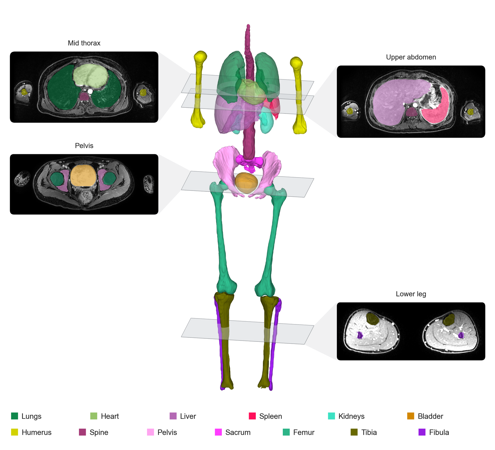

# CASIMIR: An Open Pediatric Model for Whole-Body T1-Weighted MRI Anatomy Segmentation

[](https://huggingface.co/fjhorvath/casimir)    [](LICENSE)

CASIMIR (Child Anatomy Segmentation In MRI with Increased Robustness) is a 2D
[nnU-Net v2](https://github.com/MIC-DKFZ/nnUNet) model that segments six visceral organs and
seven skeletal structures in pediatric and young-adult whole-body T1-weighted MRI, paired
structures labeled by side. The model and its evaluation are described in a manuscript that
is not yet published.

<p align="center">
  <picture>
    <source media="(prefers-color-scheme: dark)" srcset="assets/casimir-overview-dark.png">
    
  </picture>
</p>

## Installation

```bash
pip install git+https://github.com/fjhorvath/casimir.git@v1.0.0
```

Python 3.10 or newer. For an editable install, clone the `v1.0.0` tag and run
`pip install -e .` inside it.

## Inference

```bash
casimir -i <nifti file or directory> -o <output directory>
```

Add `--device cpu` if there is no NVIDIA GPU, or `--device mps` on Apple silicon.
`casimir --help` lists all flags.

From Python:

```python
from casimir import inference

inference.infer("image_dir", "outdir")
```

The input is NIfTI, `.nii` or `.nii.gz`. The tested volumes were converted from DICOM with
dicom2nifti and reorientation disabled (`reorient_nifti=False`), which keeps the scanner's
axis order. nnU-Net reads the voxel array as stored, so a volume saved in another axis
order is untested.

The output is one label map per input, on the input grid and under the input filename,
with the voxel values listed below. One whole-body examination takes about 1.5 minutes on
an RTX 4090 or on an Apple M2 Pro with `--device mps`, and about 4 minutes on the M2 Pro
with `--device cpu`.

## Structures

The 13 structures give 20 labels, one per side for the paired ones:

| | | | |
|---|---|---|---|
| 1 fibula left | 2 fibula right | 3 femur left | 4 femur right |
| 5 tibia left | 6 tibia right | 7 spine | 8 liver |
| 9 lung left | 10 lung right | 11 sacrum | 12 spleen |
| 13 humerus left | 14 humerus right | 15 heart | 16 urinary bladder |
| 17 pelvis left | 18 pelvis right | 19 kidney left | 20 kidney right |

Background is `0`. The mapping is also in `casimir/labels.json`.

## Weights

The weights (132 MB) are downloaded from [Hugging Face](https://huggingface.co/fjhorvath/casimir)
on the first run. 

For offline use, set `CASIMIR_WEIGHTS_PATH` to a local copy.

## Intended use

CASIMIR is a research tool, not a medical device. Do not use its output for clinical
decisions.

It was trained and evaluated on contrast-enhanced axial fat-suppressed T1-weighted
gradient-echo whole-body MRI from a single 3-T PET/MR system, in patients aged 1 to 21
years with lymphoma or post-transplant lymphoproliferative disorder. External validation is
required to establish generalizability.

## Reproducibility

This repository reproduces inference, not training. The weights are pinned to one Hugging
Face revision, nnU-Net v2.5 to one commit in `pyproject.toml`, and inference is deterministic
by default. Training used nnU-Net v2 defaults with the `2d` configuration and the
`nnUNetTrainer_100epochs` trainer, on a single fold with no cross-validation or ensembling.
`dataset.json` and `plans.json` ship with the weights. 

## License

Code and weights are released under the Apache License 2.0, see [LICENSE](LICENSE).

## Citation

Until the manuscript is published, cite the software:

```bibtex
@software{horvath2026casimir,
  author  = {Horvath, Felix J. and Barrow, Michael J. and Singh, Shashi B. and Lokesha, Yashas U. and Okpokpo, Darlene and Sivanandam, Sharanya and Gatidis, Sergios and Daldrup-Link, Heike E.},
  title   = {{CASIMIR}: An Open Pediatric Model for Whole-Body T1-Weighted {MRI} Anatomy Segmentation},
  version = {1.0.0},
  year    = {2026},
  url     = {https://github.com/fjhorvath/casimir}
}
```

CASIMIR is built on nnU-Net, please also cite
[Isensee et al. (2021)](https://doi.org/10.1038/s41592-020-01008-z).

## Funding

This work was supported by a grant from the National Cancer Institute, grant number R01 CA269231.\
Felix J. Horvath was supported by a travel grant from the Rolf W. Günther Foundation for Radiological Sciences.
